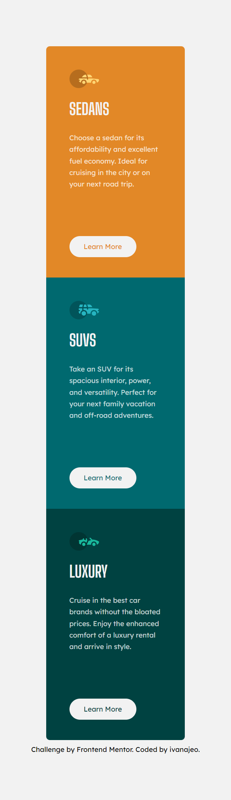

# Frontend Mentor - 3-column preview card component solution

This is a solution to the [3-column preview card component challenge on Frontend Mentor](https://www.frontendmentor.io/challenges/3column-preview-card-component-pH92eAR2-). 

### The challenge

Users should be able to:

- View the optimal layout depending on their device's screen size
- See hover states for interactive elements

### Screenshot

Desktop view  

Desktop view + hover  

Mobile view        

Mobile view + hover                        

### Links

- Solution URL: [click here](https://github.com/ivanajeo/frontend-mentor-projects/tree/main/3-column-preview-card-frontend-mentor)
- Live Site URL: [click here](https://ivanajeo.github.io/frontend-mentor-projects/3-column-preview-card-frontend-mentor/index.html)
