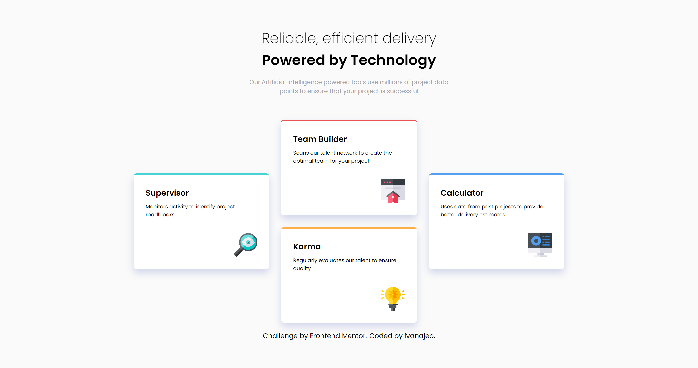
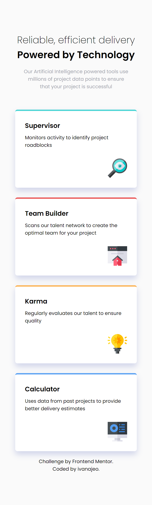

# Frontend Mentor - Four card feature section solution

This is a solution to the [Four card feature section challenge on Frontend Mentor](https://www.frontendmentor.io/challenges/four-card-feature-section-weK1eFYK). 

## Overview

### The challenge

Users should be able to:

- View the optimal layout for the site depending on their device's screen size

### Screenshot

Desktop view

Mobile view                                    

### Links

- Solution URL: [here](https://github.com/ivanajeo/frontend-mentor-projects/tree/main/four-card-feature-section-frontend-mentor)
- Live Site URL: [here](https://ivanajeo.github.io/frontend-mentor-projects/four-card-feature-section-frontend-mentor/index.html)
