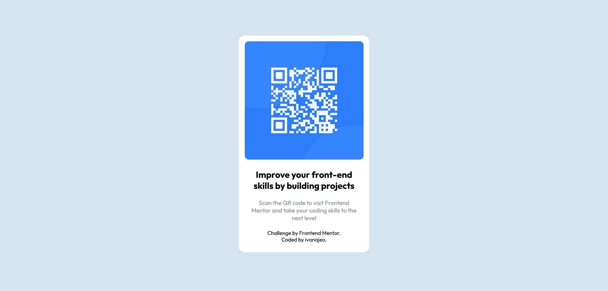

# Frontend Mentor - QR code component solution

This is a solution to the [QR code component challenge on Frontend Mentor](https://www.frontendmentor.io/challenges/qr-code-component-iux_sIO_H).

## Screenshot

Desktop view

Mobile view                       
           

## Links

- Solution URL: [here](https://github.com/ivanajeo/frontend-mentor-projects/tree/main/qr-code-component-frontend-mentor)
- Live Site URL: [here](https://ivanajeo.github.io/frontend-mentor-projects/qr-code-component-frontend-mentor/index.html)
