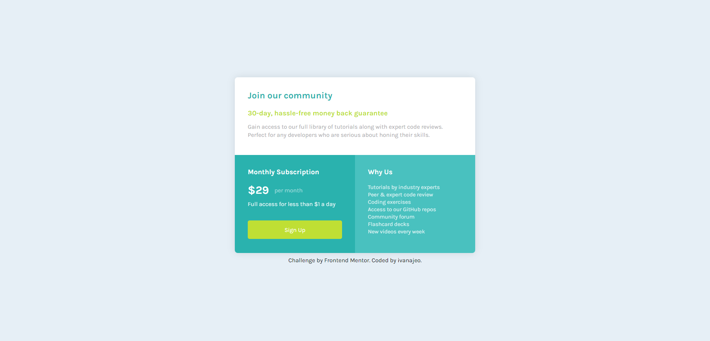
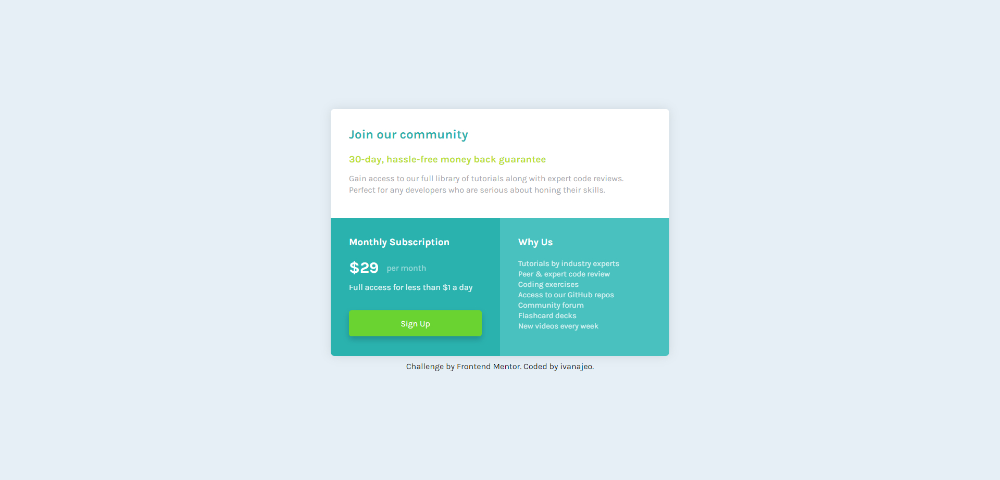

# Frontend Mentor - Single price grid component solution

This is a solution to the [Single price grid component challenge on Frontend Mentor](https://www.frontendmentor.io/challenges/single-price-grid-component-5ce41129d0ff452fec5abbbc).

## Overview

### The challenge

Users should be able to:

- View the optimal layout for the component depending on their device's screen size
- See a hover state on desktop for the Sign Up call-to-action

### Screenshot

Desktop view  

Desktop view hover  

Mobile view  

Mobile view hover  

### Links

- Solution URL: [here](https://github.com/ivanajeo/frontend-mentor-projects/tree/main/single-price-grid-frontend-master)
- Live Site URL: [here](https://ivanajeo.github.io/frontend-mentor-projects/single-price-grid-frontend-master/index.html)
